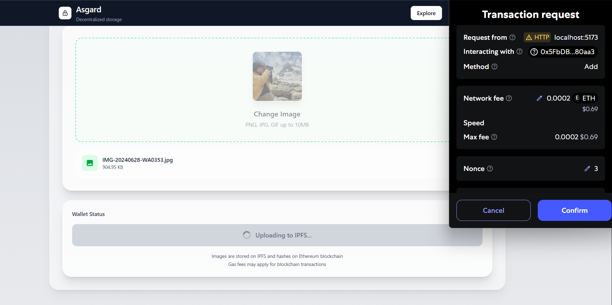
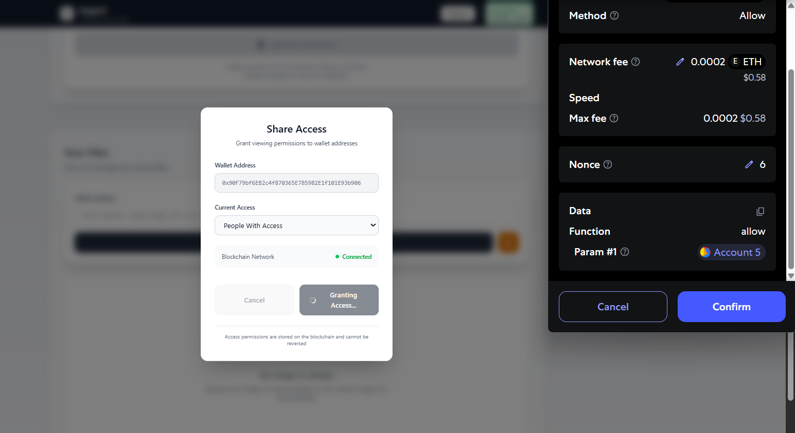
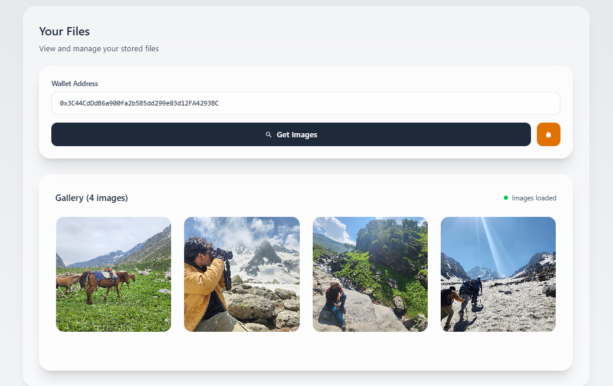

# 🏰 Asgard - Decentralized Image Storage Platform

**🔥 A realm of True Ownership**

## Overview
Asgard revolutionizes digital asset storage by combining cutting-edge blockchain technology with decentralized file systems. Built on Polygon's high-performance network and IPFS protocol, it delivers enterprise-grade security with consumer-friendly usability.

## Screenshots

  
  
  
  Refer the Explore page for easy onboarding.

## Key Benefits
- True Ownership: Cryptographic proof of ownership with no central authority control
- Lightning Performance: 2-second transaction finality with sub-cent costs
- Decentralized Architecture: IPFS distributed storage with zero single points of failure
- Enterprise Security: Smart contract access control with zero-knowledge privacy
- User Friendly: Automatic network switching and intuitive interface

## Technology Stack

- **Frontend:** React 18.2, Vite 5.0, TailwindCSS 3.4, JavaScript ES2024
- **Blockchain:** Solidity 0.8.19, Ethers.js 6.15, Hardhat 2.22, Polygon Amoy
- **Infrastructure:** IPFS, Pinata Gateway, Vercel Deployment(For Frontend), Polygon Amoy Testnet(For Blockchain)
- **Tools:** RemixIDE, VSCode

## Features

- Decentralized Upload: Store images on IPFS with blockchain verification
- Smart Access Control: Grant/revoke viewing permissions via smart contracts
- Real-time Gallery: View your images and shared content instantly
- Wallet Integration: Seamless MetaMask connectivity with auto-network switching
- Professional UI: Corporate-grade design with responsive layouts
- Performance Optimized: Fast loading with efficient blockchain interactions
  
**System Flow:** User Upload → IPFS Storage → Blockchain Hash → Smart Contract → Access Control → Decentralized Retrieval

## 📊 Performance Metrics

| Metric | Value | Industry Standard |
|--------|-------|------------------|
| **Transaction Speed** | 2.1 seconds | ~15 seconds (Ethereum) |
| **Upload Cost** | $0.001 USD | $5-50 USD (Ethereum) |
| **File Retrieval** | <300ms | ~1-2 seconds |
| **Smart Contract Gas** | ~80,000 units | ~200,000+ typical |
| **Platform Uptime** | 99.9% | 99.5% target |

## 📚 Learn More About Web3

New to Web3? Master the technologies behind Asgard with these official resources:

**Core Technologies:** [Ethereum Official Docs](https://ethereum.org/en/developers/docs/) • [Polygon Documentation](https://docs.polygon.technology/) • [IPFS Protocol Docs](https://docs.ipfs.tech/) • [Pinata IPFS Gateway](https://docs.pinata.cloud/)

**Development Framework:** [Solidity Language Docs](https://docs.soliditylang.org/) • [Hardhat Development Environment](https://hardhat.org/hardhat-runner/docs/getting-started) • [Ethers.js Library](https://docs.ethers.org/v6/) • [MetaMask Developer Docs](https://docs.metamask.io/)

**Foundational Reading:** [Bitcoin Whitepaper](https://bitcoin.org/bitcoin.pdf) • [Ethereum Whitepaper](https://ethereum.org/en/whitepaper/) • [IPFS Whitepaper](https://github.com/ipfs/papers/raw/master/ipfs-cap2pfs/ipfs-p2p-file-system.pdf) • [Polygon Architecture](https://docs.polygon.technology/docs/develop/ethereum-polygon/getting-started/)
